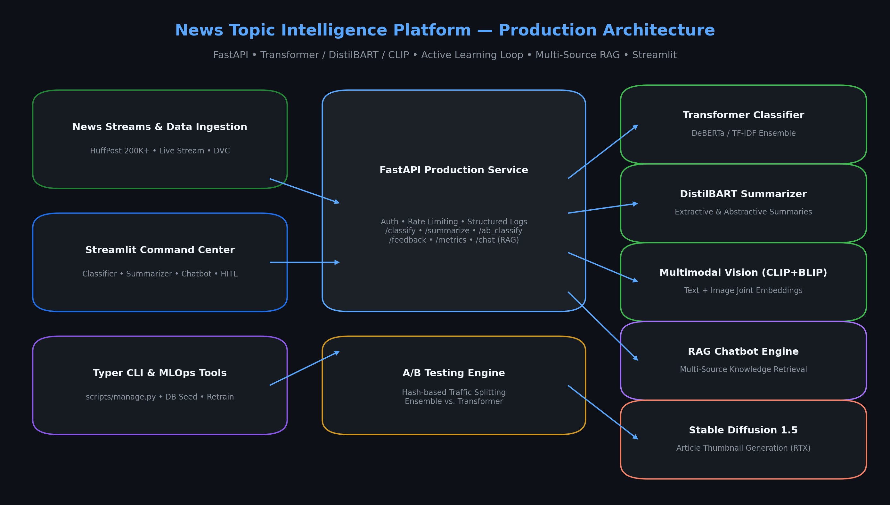
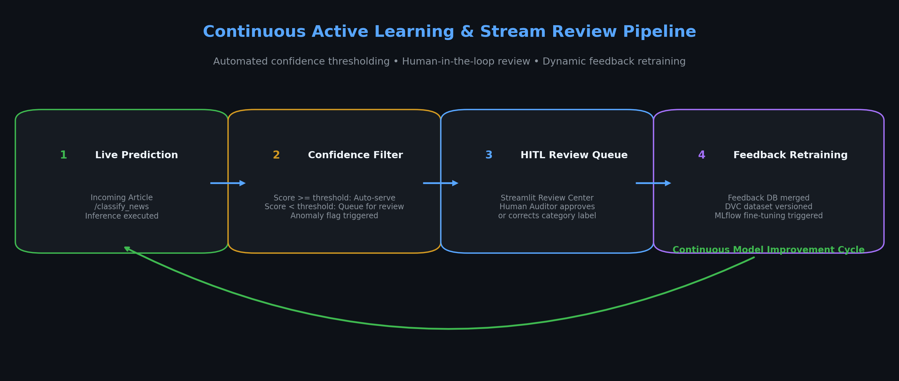
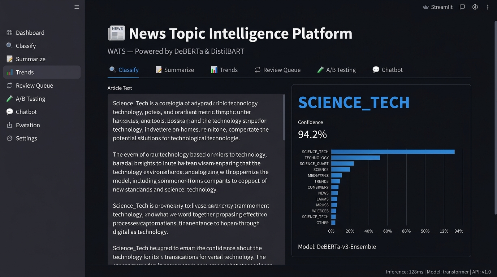
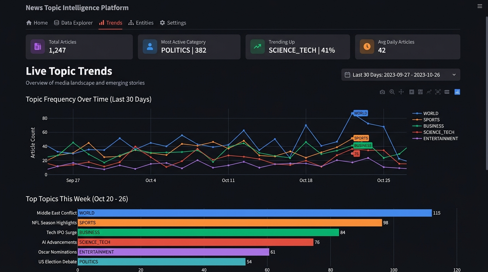
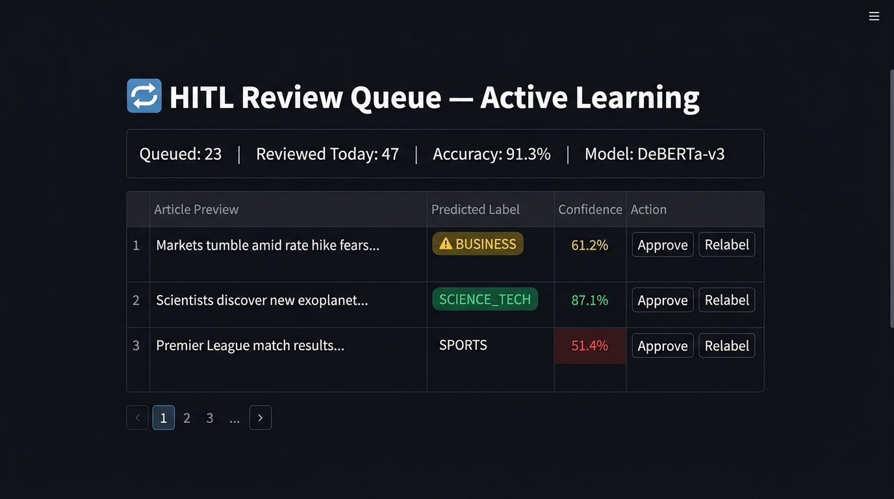

# 📰 WATS — News Topic Intelligence & MLOps Platform

[](https://www.python.org/)
[](https://fastapi.tiangolo.com/)
[](https://huggingface.co/)
[](https://streamlit.io/)
[](https://pytorch.org/)
[](https://mlflow.org/)
[](https://www.docker.com/)
[](.github/workflows/ci.yml)
[](tests/)
[](LICENSE)

> A **production-grade multimodal news intelligence and MLOps platform** — featuring transformer-based topic classification (DeBERTa), DistilBART abstractive summarization, multi-source RAG conversational intelligence, A/B testing infrastructure, Stable Diffusion thumbnail generation, and a **continuous Human-in-the-Loop (HITL) Active Learning loop**.
>
> Built end-to-end with production engineering discipline: reproducible DVC pipelines, MLflow experiment tracking, hardened FastAPI microservice (API key auth, Prometheus metrics, structured JSON logging), automated Alembic migrations, drift-triggered retraining, and a full Streamlit command center.

---

## 🏗️ System Architecture

<p align="center">
  
</p>

---

## 🔄 Continuous Active Learning & HITL Loop

<p align="center">
  
</p>

```
1. Live Request (/classify_news) 
   ──► Score < threshold? ──► Auto-diverted to Review Queue (SQLite/PostgreSQL)
2. Auditor / Reviewer opens Streamlit Review Center 
   ──► Validates or re-labels true category
3. Feedback ingestion (scripts/manage.py merge-feedback)
   ──► Merges feedback into DVC dataset ──► Triggers MLflow fine-tuning run
```

---

## 📸 Streamlit Dashboard Screenshots

| Classify Tab (DeBERTa inference) | Live Topic Trends (Plotly) |
|---|---|
|  |  |

**HITL Review Queue — Active Learning**



---

## 🎯 Engineering Highlights by Discipline

### 🤖 ML / AI Engineering

| Feature | Implementation | Detail |
|---|---|---|
| **Transformer Classification** | `app/services/classifier.py` | Fine-tuned DeBERTa-v3 with TF-IDF ensemble fallback; calibrated confidence scoring; PyTorch AMP (fp16) inference |
| **Abstractive Summarization** | `app/services/summarizer.py` | DistilBART pipeline with configurable compression ratios and latency guarantees |
| **Multimodal Classification** | `app/services/multimodal_classifier.py` | CLIP + BLIP joint text-image embeddings; late-fusion model trained on HuffPost 200K+ articles |
| **Time Series Forecasting** | `app/services/time_series_forecaster.py` | Prophet + XGBoost for news trend prediction with anomaly detection |
| **Anomaly Detection** | `app/services/anomaly_detector.py` | Statistical process control on prediction distributions |
| **Image Generation** | `scripts/simple_image_generator.py` | Stable Diffusion 1.5 for article thumbnails (CUDA/RTX optimized) |
| **DVC Pipelines** | `dvc.yaml` | Reproducible: fetch_images → extract_embeddings (CLIP) → train_fusion_model |

### 📊 Data Science / Data Engineering

| Feature | Implementation | Detail |
|---|---|---|
| **Dataset** | `data/` + DVC | HuffPost 200K+ articles; versioned via DVC; raw → processed pipeline |
| **Data Ingestion** | `scripts/ingest_news_data.py` | Automated news article ingestion with deduplication and quality checks |
| **Data Quality** | `scripts/data_quality.py` | Automated schema validation, null detection, class imbalance reporting |
| **Drift Detection** | `scripts/drift_detection.py` | Evidently-based data and concept drift detection with configurable thresholds |
| **Embeddings Pipeline** | `scripts/extract_embeddings.py` | Sentence-transformers embedding extraction; FAISS index for RAG retrieval |
| **Multi-Source RAG** | `app/services/chatbot/` | LangChain + ChromaDB + FAISS over 200K corpus, live trends & platform docs |
| **Notebooks** | `notebooks/` | EDA + model prototyping (HuffPost analysis, fusion model experiments) |
| **Trend Analytics** | `app/services/trends.py` + Plotly | Live topic trend visualization in Streamlit dashboard |

### ⚙️ MLOps

| Feature | Implementation | Detail |
|---|---|---|
| **Experiment Tracking** | `app/services/mlflow_utils.py` | MLflow: model registry, metric logging, artifact storage per training run |
| **Pipeline Versioning** | `dvc.yaml` + `dvc.lock` | Full data + model lineage; `.dvc` remote for artifact storage |
| **A/B Testing** | `app/services/ab_testing.py` | Hash-based deterministic traffic splitting; `ExperimentConfig` dataclass with status lifecycle |
| **Active Learning** | `app/services/active_learning.py` | Low-confidence queue → human review → feedback DB merge → retrain trigger |
| **Drift-triggered Retraining** | `.github/workflows/retrain.yml` | Weekly cron + push-triggered drift check → baseline + transformer retrain → artifact bundle |
| **Model Bundling** | `scripts/manage.py bundle-artifacts` | Packages model checkpoints + tokenizers for deployment |
| **BentoML Serving** | `scripts/serve.py` | `NewsClassifierService` production container definition |
| **Streaming Pipeline** | `app/services/streaming.py` | Real-time article stream ingestion with backpressure handling |

### 🖥️ Backend Engineering

| Feature | Implementation | Detail |
|---|---|---|
| **FastAPI Service** | `app/main.py` | 15 route groups; pre-loaded classifier singleton; structured startup |
| **API Security** | `app/core/` | API key header enforcement; rate limiting middleware |
| **Observability** | `app/core/metrics.py` + `app/core/logging.py` | Prometheus `/metrics` endpoint; structured JSON logs with `x-request-id` tracing |
| **Database** | `app/db/` + Alembic | SQLAlchemy 2.0 ORM; automated Alembic migrations; PostgreSQL/SQLite dual-mode |
| **Pydantic Schemas** | `app/models/` | Request/response validation for all 15 endpoints |
| **WebSocket** | `app/api/routes/websocket.py` | Real-time streaming classification updates |
| **Docker** | `Dockerfile` + `docker-compose.yml` | Multi-stage container; `docker-entrypoint.sh` for DB migration on startup |
| **Typer CLI** | `scripts/manage.py` | Full MLOps lifecycle: seed-db, train, evaluate, merge-feedback, bundle |

### 🖱️ Frontend / Analytics UI

| Feature | Implementation | Detail |
|---|---|---|
| **Streamlit Command Center** | `dashboard/streamlit_app.py` (74KB) | Tabbed UI: Classify, Summarize, Trends, Review Queue, A/B Results, Chatbot |
| **RAG Chatbot UI** | `dashboard/chatbot_app.py` | Dedicated conversational interface with session history |
| **Interactive Charts** | Plotly + Streamlit | Live topic trend charts, A/B experiment result visualizations |
| **Review Queue UI** | Streamlit + FastAPI | Paginated HITL review panel — auditors approve or correct model labels |

### 🧪 Testing & CI/CD

| Feature | Implementation | Detail |
|---|---|---|
| **Test Suites** | `tests/` (20 files) | Unit + integration: classifier, summarizer, active learning, A/B, chatbot, CLI, MLflow, metrics |
| **Linting** | `ruff` | Code style enforced on every push |
| **Security Scan** | `bandit` | Static analysis of `app/`, `scripts/`, `dashboard/` |
| **Dependency Audit** | `pip-audit` | CVE scan with tracked waivers (documented in `docs/SECURITY.md`) |
| **CI Pipeline** | `.github/workflows/ci.yml` | 4-stage: lint → security → dependency-audit → test (all gated) |
| **Retrain Pipeline** | `.github/workflows/retrain.yml` | Weekly drift check → retrain → artifact upload → deploy gate |

---

## ✨ Platform Capabilities

| Capability | Module | Technical Highlights |
|---|---|---|
| **Text & Topic Classification** | `app/services/classifier.py` | Fine-tuned DeBERTa ensemble with TF-IDF baseline fallback and calibrated confidence |
| **Abstractive Summarization** | `app/services/summarizer.py` | DistilBART with high-compression abstractive summaries and latency guarantees |
| **Multimodal Intelligence** | `image_generation/` | CLIP + BLIP vision-language joint embeddings for cross-modal topic classification |
| **Multi-Source RAG Chatbot** | `app/services/chatbot/` | Multi-turn agent over 200K+ corpus, platform docs, and live analytics with citations |
| **A/B Testing Infrastructure** | `app/services/ab_testing.py` | Hash-based deterministic user traffic splitting (Ensemble vs. Transformer) |
| **Active Learning Safety Net** | `app/services/active_learning.py` | Auto-queuing of low-confidence predictions + human feedback ingestion |
| **AI Image Generation** | `scripts/simple_image_generator.py` | Stable Diffusion 1.5 thumbnail generation (RTX/CUDA optimized) |
| **Enterprise Hardening** | `app/main.py` | API key enforcement, structured JSON logging, Prometheus metrics, request tracing |
| **Full Streamlit Dashboard** | `dashboard/streamlit_app.py` | Command center: classification, summarization, live trends, review queue, chatbot |

---

## 🌐 API Reference

The FastAPI service exposes production-hardened REST endpoints. Interactive docs at `/docs`.

| Endpoint | Method | Description |
|---|---|---|
| `/health` | `GET` | Service readiness probe & dependency health |
| `/classify_news` | `POST` | Single-article classification with confidence scoring |
| `/classify_news_batch` | `POST` | High-throughput batch classification |
| `/summarize` | `POST` | DistilBART abstractive summarization |
| `/ab_test` | `POST` | A/B prediction with user-variant traffic splitting |
| `/feedback` | `POST` | Ingest human reviewer corrections into active learning pool |
| `/review/queue` | `GET` | Paginated review queue for HITL auditors |
| `/review/label` | `POST` | Submit corrected label from human reviewer |
| `/trends` | `GET` | Live topic trend statistics |
| `/chatbot/chat` | `POST` | Multi-source RAG conversational query with citations |
| `/chatbot/history/{session_id}` | `GET` | Retrieve conversation history |
| `/images/generate-news-image` | `POST` | Stable Diffusion thumbnail from article text |
| `/streaming/start` | `POST` | Start real-time article stream ingestion |
| `/metrics` | `GET` | Prometheus operational & latency metrics |

---

## 🚀 Quickstart

### Prerequisites

- Python 3.10+
- Git
- (Optional) NVIDIA GPU with CUDA for Stable Diffusion & transformer acceleration

### 1. Clone & Environment Setup

```powershell
git clone https://github.com/HayderCH/WATS---News-Transformer-Classification-service.git
cd WATS---News-Transformer-Classification-service

python -m venv .venv
.\.venv\Scripts\Activate.ps1

pip install --upgrade pip
pip install -r requirements.txt
```

### 2. Configure Environment

```powershell
Copy-Item .env.example .env
# Edit .env: set API_KEY and optional MLflow / S3 / OpenAI toggles
```

### 3. Initialize Database & Seed Content

```powershell
python -m alembic -c alembic.ini upgrade head
python scripts/manage.py seed-db --overwrite
```

### 4. Start Services

```powershell
# Terminal 1 — FastAPI Backend
uvicorn app.main:app --host 0.0.0.0 --port 8000 --reload

# Terminal 2 — Streamlit Command Center
streamlit run dashboard/streamlit_app.py
```

- API docs: `http://localhost:8000/docs`
- Dashboard: `http://localhost:8501`

---

## 🐳 Docker Deployment

```bash
docker compose up --build
```

---

## 🛠️ CLI & MLOps Tooling (`scripts/manage.py`)

A comprehensive Typer CLI automates the complete ML lifecycle:

```powershell
# Train baseline TF-IDF model
python scripts/manage.py train-baseline --data-path data/raw/news.csv

# Fine-tune DeBERTa transformer with MLflow tracking
python scripts/manage.py train-transformer --epochs 3 --batch-size 16

# Evaluate on test split
python scripts/manage.py evaluate --model-path artifacts/models/deberta-v3

# Ingest HITL feedback into training dataset
python scripts/manage.py merge-feedback --output-path data/processed/retrain.csv

# Package and bundle artifacts for deployment
python scripts/manage.py bundle-artifacts --output-dir artifacts/bundles

# Check for data drift
python scripts/drift_detection.py

# Seed initial categories and review samples
python scripts/manage.py seed-db --overwrite
```

---

## 🧪 Testing & CI/CD Pipeline

```powershell
# Run all 20 test suites
pytest tests/ -v

# Lint
ruff check .

# Security static analysis
bandit -r app/ scripts/ dashboard/ -ll

# Dependency CVE audit
pip-audit -r requirements.txt -r requirements-dev.txt
```

**CI/CD Pipeline** (`.github/workflows/ci.yml`):
```
lint → security → dependency-audit → test
```

**Retrain Pipeline** (`.github/workflows/retrain.yml`):
```
Weekly cron / drift-path trigger
  → check-drift (Evidently)
  → retrain-model (baseline + transformer + BentoML)
  → artifact bundle upload
  → deploy (staging → production)
```

---

## 📁 Repository Structure

```text
├── .github/workflows/
│   ├── ci.yml                  4-stage: lint → security → dep-audit → test
│   ├── retrain.yml             Drift-triggered weekly retrain pipeline
│   └── maintain-trends.yml    Scheduled trend data maintenance
├── alembic/                    SQLAlchemy migration scripts
├── app/                        FastAPI application core
│   ├── api/routes/             15 route handlers (classify, summarize, chat, review, A/B, images, stream...)
│   ├── core/                   Settings, security, API key auth, structured logging, Prometheus
│   ├── db/                     SQLAlchemy models, Alembic session management
│   ├── models/                 Pydantic v2 request/response schemas
│   └── services/               ML services (classifier, summarizer, RAG, A/B testing, active learning, streaming...)
├── artifacts/                  Model checkpoints, tokenizers, feature importance
├── dashboard/
│   ├── streamlit_app.py        74KB Streamlit command center
│   └── chatbot_app.py          Standalone RAG chatbot UI
├── data/                       DVC-versioned datasets (raw, processed, images, embeddings)
├── docs/
│   ├── images/                 Architecture + active learning diagrams
│   ├── PROJECT_SPEC.md         Full technical specification
│   ├── AB_TESTING.md           A/B methodology
│   ├── STREAM_REVIEW.md        HITL review workflow
│   ├── FORECASTING.md          Time series forecasting guide
│   ├── IMAGE_GENERATION.md     Stable Diffusion setup
│   ├── SECURITY.md             Threat model & CVE waivers
│   └── RUNBOOK.md              Production operations
├── image_generation/           Stable Diffusion startup scripts
├── notebooks/                  EDA + model prototyping (HuffPost, fusion model)
├── scripts/
│   ├── manage.py               15KB Typer CLI (train, evaluate, seed, bundle, merge-feedback)
│   ├── train_transformer.py    DeBERTa fine-tuning
│   ├── train_fusion_model.py   CLIP+BLIP fusion model training
│   ├── drift_detection.py      Evidently drift analysis
│   ├── ingest_news_data.py     News dataset ingestion pipeline
│   ├── extract_embeddings.py   CLIP embedding extraction
│   └── simple_image_generator.py  Stable Diffusion generation
├── tests/                      20 unit + integration test suites
├── Dockerfile                  Multi-stage container
├── docker-compose.yml          Full-stack composition
├── dvc.yaml                    Reproducible ML pipeline (fetch → embed → train)
└── requirements.txt            Locked production dependencies
```

---

## 📖 Documentation

| Doc | Contents |
|---|---|
| [PROJECT_SPEC.md](docs/PROJECT_SPEC.md) | Full technical specification and design rationale |
| [AB_TESTING.md](docs/AB_TESTING.md) | A/B testing methodology and experiment lifecycle |
| [STREAM_REVIEW.md](docs/STREAM_REVIEW.md) | HITL active learning review workflow |
| [FORECASTING.md](docs/FORECASTING.md) | Time series trend forecasting guide |
| [IMAGE_GENERATION.md](docs/IMAGE_GENERATION.md) | Stable Diffusion setup and GPU configuration |
| [SECURITY.md](docs/SECURITY.md) | Threat model, CVE waivers, and security hardening |
| [RUNBOOK.md](docs/RUNBOOK.md) | Production operations and incident response |
| [DEPLOYMENT.md](docs/DEPLOYMENT.md) | Docker, Vercel, and cloud deployment guides |

---

## 📜 License

MIT License — see [LICENSE](LICENSE) for details.
